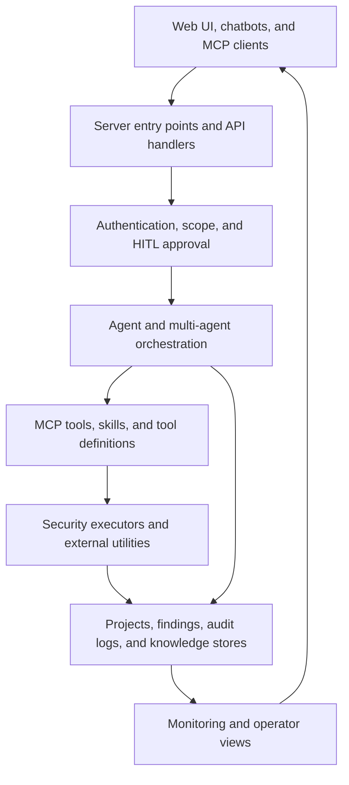

# Architecture Overview

CyberStrikeAI separates interfaces, policy controls, orchestration, execution, and
evidence storage so authorized security work can be reviewed and traced.

## Trust Boundaries

- **Untrusted input:** user prompts, model output, uploaded content, remote tool
  results, and external MCP responses require validation.
- **Policy boundary:** authentication, authorized scope, and human approval determine
  whether sensitive operations may proceed.
- **Execution boundary:** tool definitions and executors translate reviewed intent
  into local or remote actions.
- **Evidence boundary:** logs, findings, conversations, and exports may contain
  sensitive data and require access control, redaction, and retention policies.

See [Security Architecture and Roadmap](security-roadmap.md) for package-level
responsibilities, future work, and responsible disclosure guidance.
